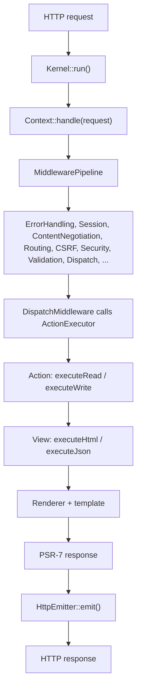

Every HTTP request in Quiote follows the same path: the kernel builds a PSR-7 request, hands it to the context, the context runs it through a PSR-15 middleware pipeline, and one of those middlewares dispatches an action and renders a view. This page traces that path and names the real classes at each step.

## The big picture



## 1. Boot — `Quiote\Runtime\Kernel`

The front controller calls `Kernel::create([...])->run()`. `run()` does four things:

1. **Bootstrap** — sets core paths (`core.app_dir` and friends), decides whether the APCu config cache is usable, and calls `Quiote::bootstrap()` to load `settings`, create the requested context(s), and prime the controller.
2. **Pick a worker adapter** — `FrankenPhpWorkerAdapter` if FrankenPHP is available, otherwise `SingleRequestAdapter`. The adapter owns the request loop.
3. **Build the request** — `buildRequestFromGlobals()` uses Nyholm's `ServerRequestCreator::fromGlobals()`, applies reverse-proxy corrections (`X-Forwarded-*`), then wraps the result in a `Quiote\Request\WebRequest` (which extends Nyholm's `ServerRequest`).
4. **Handle and emit** — for each request it calls `$context->handle($request)` and passes the response to `HttpEmitter::emit()`. Any exception that escapes is rendered through `ErrorHandlingMiddleware::renderExceptionResponse()`.

Under FrankenPHP, steps 1–2 happen once per worker; steps 3–4 repeat per request. State that must not leak between requests is reset via `WorkerManager::resetForNextRequest()`.

## 2. Enter the pipeline — `Context::handle()`

`Quiote\Context::handle()` is the PSR-15 entry point. It lazily builds a single `Quiote\Middleware\MiddlewarePipeline` and reuses it for the worker's lifetime:

```php
public function handle(ServerRequestInterface $request): ResponseInterface
{
    if (self::$psrKernel === null) {
        self::$psrKernel = new \Quiote\Middleware\MiddlewarePipeline($this);
    }
    $request = $request->withAttribute("quiote.rid", $this->correlationId);
    return self::$psrKernel->handle($request);
}
```

It also stamps a correlation id (`quiote.rid`) onto the request for logging.

## 3. The middleware pipeline

`MiddlewarePipeline` builds the chain once (`doBuild()`) and runs it via [Relay](https://relayphp.com/). The full ordered stack and what each middleware does is documented in [The middleware pipeline](/architecture/middleware-pipeline/). The important ones for the lifecycle:

- **RoutingMiddleware** matches the path, resolves `_module`/`_action`, negotiates the output type, and builds an `ActionDescriptor`.
- **SecurityMiddleware** decides whether the request is allowed to run the action.
- **ValidationMiddleware** runs the action's validators and records a pass/fail decision.
- **DispatchMiddleware** actually runs the action and renders the view. It is effectively terminal.

## 4. Dispatch — `DispatchMiddleware` and `ActionExecutor`

`DispatchMiddleware` reads the `ActionDescriptor` from the request (404 if there isn't one) and delegates to `Quiote\Execution\ActionExecutor::execute()`. The executor:

1. **Creates the action** via `Controller::createActionInstance($module, $action)`.
2. **Initializes it** with a lightweight init context (context, module, action, method, output type, request, response) through `$action->initialize(...)`.
3. **Runs it** — `ActionResolver` picks the method from the HTTP verb (`executeRead` for GET, `executeWrite` for POST, `executeUpdate` for PUT/PATCH, `executeRemove` for DELETE, or a verb-exact method), falling back to `execute`. The return value is a view name.
4. **Snapshots attributes** the action set via `setAttribute()`.
5. **Resolves the view** — `ViewNameResolver` turns `(module, action, viewName)` into a view class, e.g. `IndexSuccessView`.
6. **Runs the view** — `selectViewMethod()` picks `execute<OutputType>()` (e.g. `executeHtml`) if it exists, else `execute()`. If the method returns null but layers were loaded, `renderLayers()` runs the templates.

The executor returns an `ActionExecutionContext` carrying the rendered content, the view identity, the attribute bag, and any redirect. See [Actions and views](/architecture/actions-and-views/) for the contract in detail.

## 5. Build the response

`DispatchMiddleware` turns the execution result into a Nyholm PSR-7 response: it applies the `http_headers` configured for the output type, bridges status/headers/cookies/redirects from the framework's `WebResponse`, and adds `X-Content-Type-Options: nosniff`.

## 6. Emit — `HttpEmitter`

Back in the kernel, `HttpEmitter::emit($response)` writes the PSR-7 response to the client. Under a persistent worker the loop then resets per-request state and waits for the next request.

## Two request flavours

Not every request runs the full path:

- **Simple actions** (`isSimple()` returns true) skip execution entirely, not just validation — no `execute*()`, `validate()`, or `registerValidators()` runs, and `DispatchMiddleware` renders `getDefaultViewName()` directly. See [Actions and views](/architecture/actions-and-views/#issimple-means-no-action-code-runs-at-all).
- **Non-simple actions** require a completed validation decision before dispatch; if validation is missing, dispatch fails loudly rather than running unvalidated.

This is the safety default described in [Validation](/basics/validation/): an action that expects input does not run until that input has been validated.
